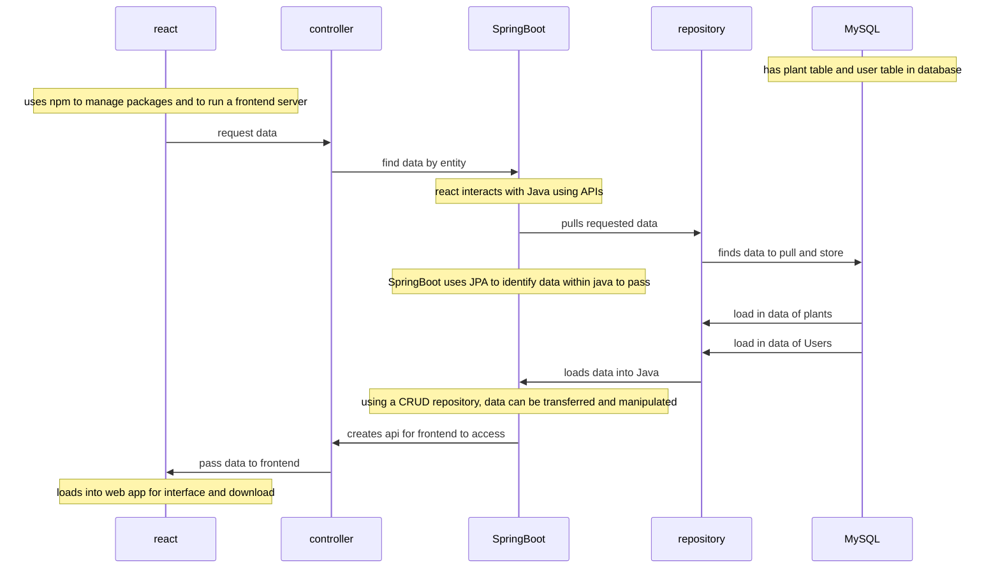

# Plant Calendar by Hydro Homies

## Instructions for App

* Type `mysql -u root -e "CREATE DATABASE plantapi"` into gitBash
* Type `npm install file-saver` and `npm install -S ics` to download packages
* Boot PlantCalendarApplication for http://localhost:8080/
* CD into frontend and Type `npm start` into Terminal to boot http://localhost:3000/

## Functionality 
Hydro Homie: The Plant Calendar is a simple and easy way of creating a watering schedule for plants.
* Login by creating a user and saving each of your plants to that user
* Select the plants you'd like to add to your watering schedule
* Filter through plants to see which ones meet your requirements
* Provides over-watering information about the selected plants
* Click the download button to install your selected plants to your calendar
* Works with all calendars that are compatible with an ics file

## Endpoints

### Plant Endpoints
- Request body example --  -d '{"name": "Test", "wateringSchedule": "FREQ=DAILY;INTERVAL=2;BYDAY=SU", 
                        "lightLevel": "Low", "waterAmount": "High", "isPetFriendly": true, "imgURL": "testURL"}'

* GET ALL PLANTS -- curl -X GET http://localhost:8080/api/plants -H 'Content-Type: application/json'
* GET SPECIFIED PLANT -- curl -X GET http://localhost:8080/api/plants/{plant_id} -H 'Content-Type: application/json'
* POST PLANT -- curl -X POST http://localhost:8080/api/plants -H 'Content-Type: application/json'
* PUT NEW RRULE -- curl -X PUT http://localhost:8080/api/addRR/{newRR} -H 'Content-Type: application/json' 

### User Endpoints
- Request body example -- -d '{"username": "Test"}'

* GET ALL USERS -- curl -X GET http://localhost:8080/api/users -H 'Content-Type: application/json'
* GET SPECIFIED USER -- curl -X GET http://localhost:8080/api/users/{username} -H 'Content-Type: application/json'
* GET USERS PLANT COLLECTION -- curl -X GET http://localhost:8080/api/users/{username}/plantCollection -H 'Content-Type: application/json'
* POST NEW USERS -- curl -X POST http://localhost:8080/api/users -H 'Content-Type: application/json'
* PUT PLANT IN USER COLLECTION -- curl -X PUT http://localhost:8080/api/users/{username}/plantCollection/{plant_id} -H 'Content-Type: application/json'
* DELETE A PLANT FROM THE USERS COLLECTION -- curl -X DELETE http://localhost:8080/api/users/{username}/plantCollection/{plant_id} -H 'Content-Type: application/json'

## Plant-Calendar-Data-flow

