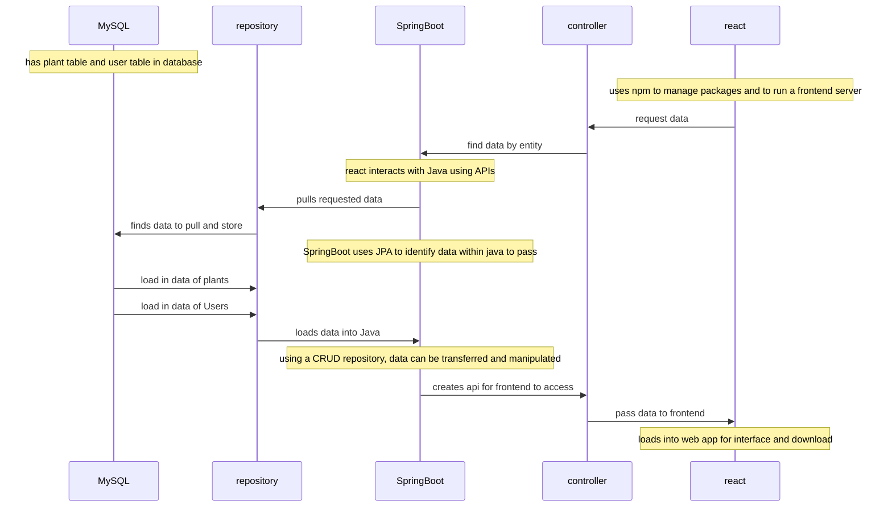

# Plant Calendar by Hydro Homies

## Instructions for App

* Type `mysql -u root -e "CREATE DATABASE plantapi"` into gitBash
* Type `npm install file-saver` and `npm install -S ics` to download packages
* Boot PlantCalendarApplication for http://localhost:8080/
* CD into frontend and Type `npm start` into Terminal to boot http://localhost:3000/

## Functionality 
The Plant Calendar is a simple and easy way of creating a watering schedule for plants.
* Login by creating a user and saving each of your plants to that user
* Select the plants you'd like to add to your watering schedule
* click the download button to install your selected plants to your calendar
* works with all calendars that are compatible with an ics file.

## Endpoints

* GET ALL PLANTS - /api/plants
* GET SPECIFIED PLANT - /api/plants/{plant_id}
* GET ALL USERS - curl -X GET http://localhost:8080/api/users -H 'Content-Type: application/json'
* POST NEW USERS - curl -X POST http://localhost:8080/api/users -H 'Content-Type: application/json' -d '{"username": "Test"}'
* PUT PLANT IN USER COLLECTION - curl -X PUT http://localhost:8080/api/users/Test/plantCollection/1 -H 'Content-Type: application/json'

## Plant-Calendar-Data-flow

